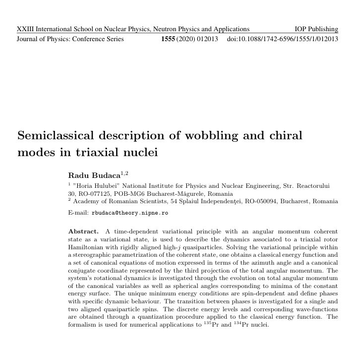
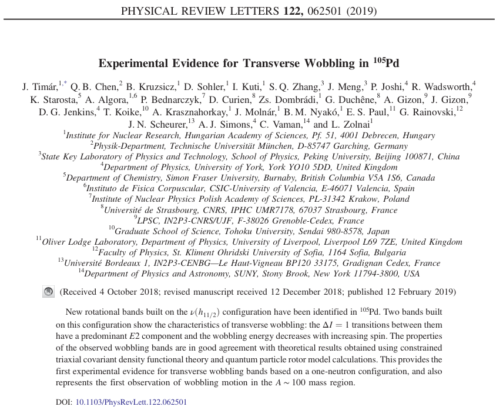
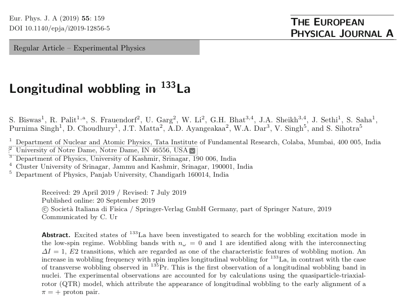
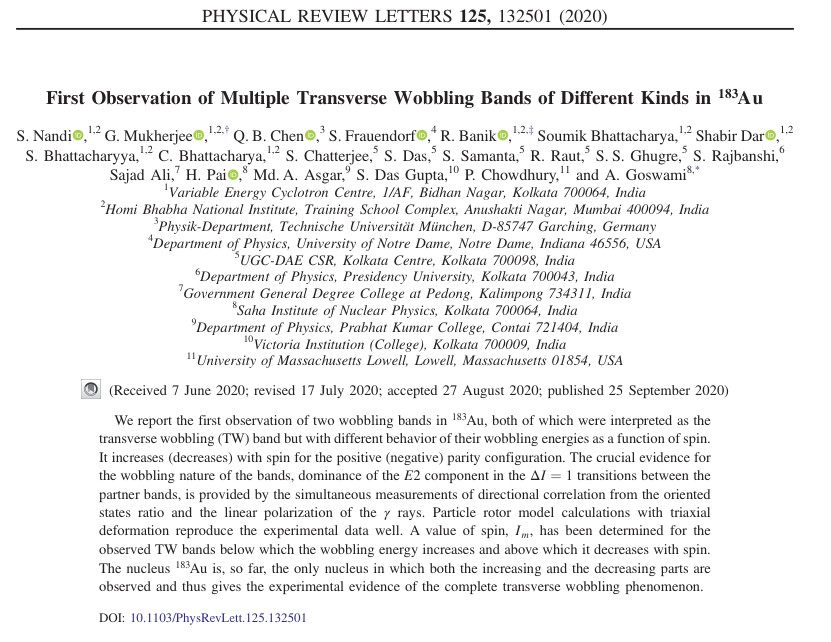
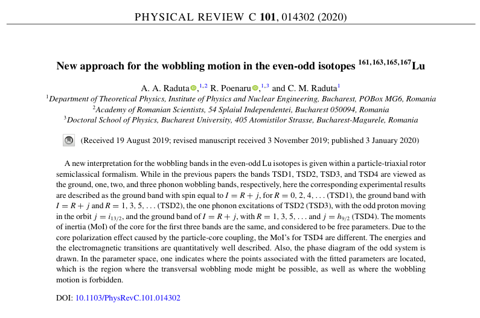
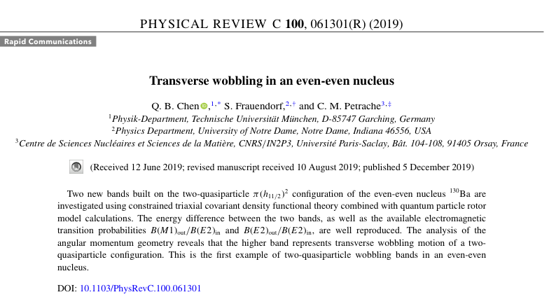

# Learning Resources

The materials used for documentation, extracting formulas, and obtaining numerical results that are used within the research.

1. 

   - Paper by Budaca in which the wobbling energies for the odd-mass $^{135}$Pr and the even-mass $^{134}$Pd are compared with the experimental data available.

2. 

   - The experimental results for $^{105}$Pd are discussed in terms of wobbling excitations.

3. 

   - The experimental results for the odd-mass $^{133}$La are presented, with identification of a one-phonon wobbling band built on on top of the $n_w=0$ yrast band in this nucleus. The wobbling motion is considered to have a **longitudinal** character.

4. 

   - The wobbling structure of $^{183}$Au is discussed in terms of the wobbling bands that are identified within the rotational spectra of the nucleus.

5. 

   - The formulas used in the research are presented in the following paper.

6. 

   - Discussion of the first example of even-even wobbling nucleus. The wobbling excitations are built on a two-quasiparticle wobbling band.
